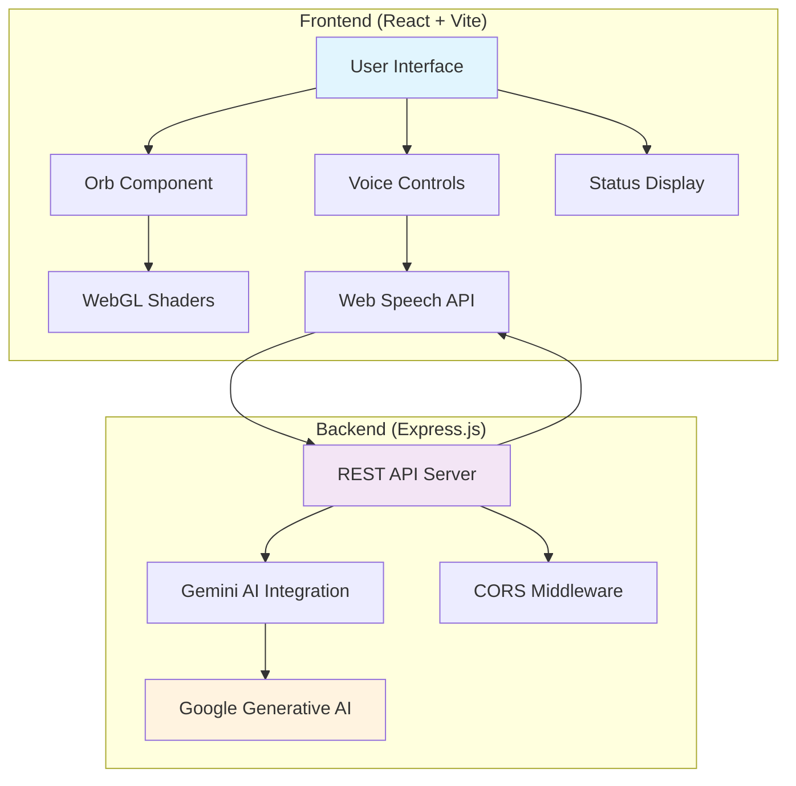
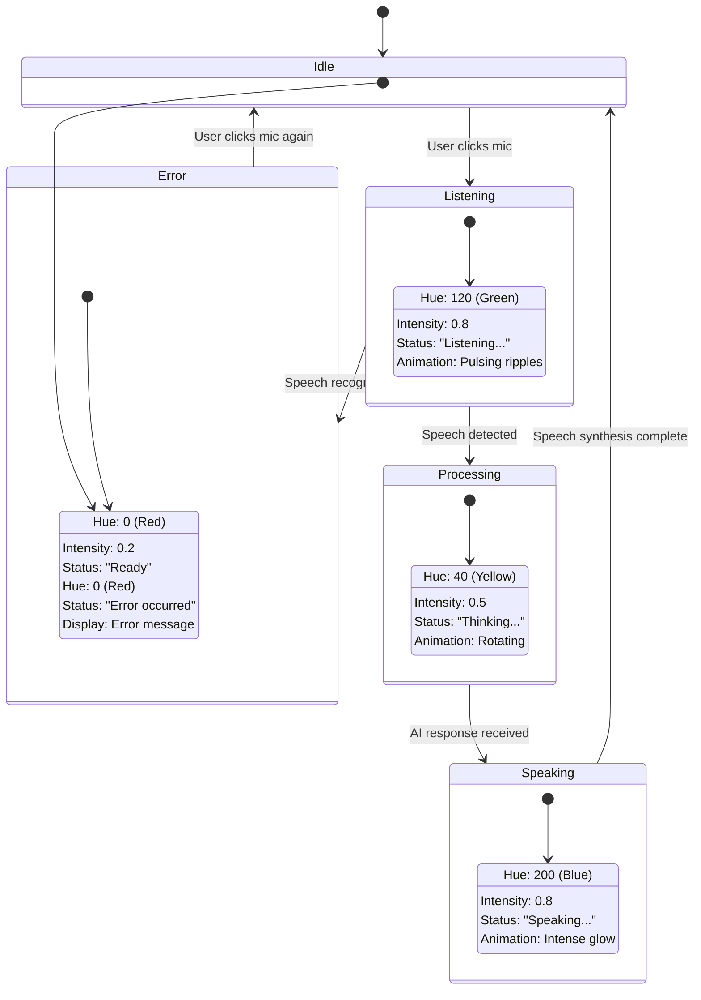
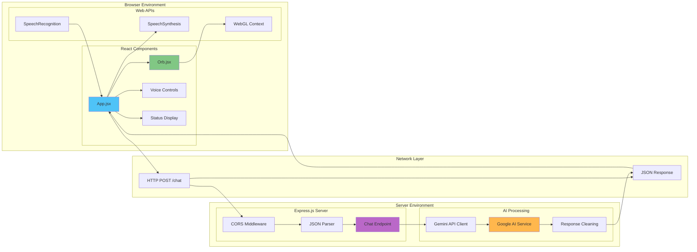
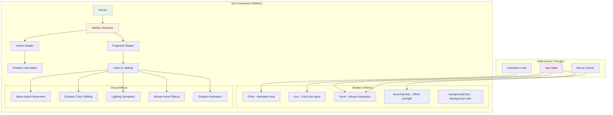
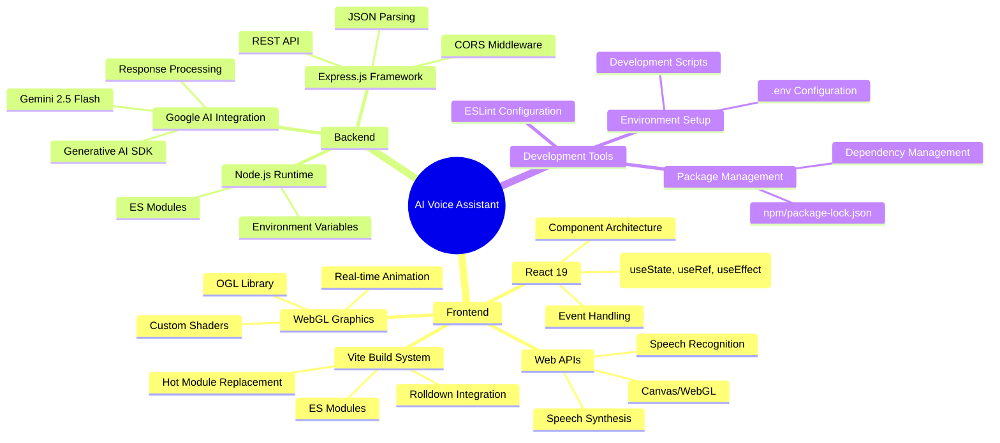

# AI Voice Assistant Workflow Diagram

## System Architecture Overview



## Detailed Workflow Process

```mermaid
sequenceDiagram
    participant U as User
    participant UI as React UI
    participant O as Orb Component
    participant WSA as Web Speech API
    parameter API as Express Server
    participant AI as Gemini AI
    participant TTS as Text-to-Speech

    Note over U,TTS: Voice Assistant Interaction Flow
    
    U->>UI: Clicks microphone button
    UI->>O: Update state (listening=true, hue=120)
    UI->>WSA: Start speech recognition
    O->>O: Animate orb (green, pulsing)
    
    WSA->>UI: Capture audio & convert to text
    UI->>UI: Display transcript (interim results)
    
    WSA->>UI: Speech recognition ends
    UI->>O: Update state (processing=true, hue=40)
    O->>O: Animate orb (yellow, rotating)
    
    UI->>API: POST /chat {message: transcript}
    API->>AI: Send prompt + user message
    AI->>API: Return AI response
    API->>UI: JSON {reply: cleanedResponse}
    
    UI->>O: Update state (speaking=true, hue=200)
    O->>O: Animate orb (blue, intense)
    UI->>TTS: Convert response to speech
    TTS->>U: Play audio response
    
    TTS->>UI: Speech synthesis complete
    UI->>O: Update state (idle=true, hue=0)
    O->>O: Return to idle animation
```

## Component State Flow



## Data Flow Architecture



## Orb Animation System



## Error Handling Flow

```mermaid
flowchart TD
    A[User Action] --> B{Browser Support?}
    B -->|No| C[Show Browser Warning]
    B -->|Yes| D[Initialize Speech Recognition]
    
    D --> E{Microphone Permission?}
    E -->|Denied| F[Show Permission Error]
    E -->|Granted| G[Start Listening]
    
    G --> H{Speech Detected?}
    H -->|No Speech| I[Show "No speech detected"]
    H -->|Audio Capture Error| J[Show "Check microphone"]
    H -->|Success| K[Process Speech]
    
    K --> L{Server Available?}
    L -->|No| M[Show "Server unavailable"]
    L -->|Yes| N[Send to AI]
    
    N --> O{AI Response OK?}
    O -->|Error| P[Show "AI error"]
    O -->|Success| Q[Speak Response]
    
    Q --> R{Speech Synthesis OK?}
    R -->|Error| S[Show text only]
    R -->|Success| T[Complete Interaction]
    
    style C fill:#ffcdd2
    style F fill:#ffcdd2
    style I fill:#fff3e0
    style J fill:#ffcdd2
    style M fill:#ffcdd2
    style P fill:#ffcdd2
    style S fill:#fff3e0
    style T fill:#c8e6c9
```

## Technology Stack Integration

